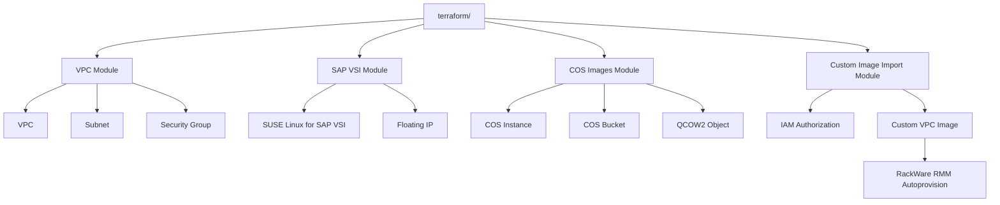

# IBM Cloud VPC Terraform

This repository now contains two Terraform entrypoints.

1. Legacy jump host configuration at the repo root (`main.tf`, `variables.tf`, `outputs.tf`).
2. RackWare migration workflow under `terraform/`.

Both are supported. The RackWare workflow is additive and does not change the legacy behavior.

**RackWare Architecture**

**RackWare Deployment**
1. Initialize the RackWare workflow:
   `terraform -chdir=terraform init`
2. Plan using a sample var file:
   `terraform -chdir=terraform plan -var-file=environments/dev/terraform.tfvars.example`
3. Apply when ready:
   `terraform -chdir=terraform apply -var-file=environments/dev/terraform.tfvars.example`

Key inputs live in `terraform/variables.tf`.

**Existing VPC Option**
Set `create_vpc = false` and provide `existing_vpc_name` to deploy into a pre-existing VPC. The module still creates the SAP subnet and security group inside that VPC.

**Custom QCOW2 Upload and Import**
Set these variables and run `terraform apply` in the `terraform/` directory.
- `enable_custom_image = true`
- `custom_image_file = "/path/to/image.qcow2"`
- `custom_image_name = "rackware-custom-sles-sap"`
- Optional `custom_image_object_key` to override the COS object name

Terraform uploads the QCOW2 image to COS and imports it into the VPC Image Catalog.

**RackWare RMM Usage**
Use the output `custom_image_id` as the image ID for RackWare RMM autoprovision workflows. The IAM authorization policy is created so the VPC image service can read from COS.

**RackWare Outputs**
- `sap_instance_id`, `sap_floating_ip`, `sap_image_id`
- `cos_bucket_name`, `cos_object_key`, `custom_image_href`
- `custom_image_id`

**RackWare Modules**
- `terraform/modules/vpc`
- `terraform/modules/sap_vsi`
- `terraform/modules/cos_images`
- `terraform/modules/custom_image_import`

**Legacy Jump Host**
The root Terraform files still build a Linux jump host in an existing VPC. Follow the existing variable descriptions in `variables.tf` and run standard `terraform init/plan/apply` from the repo root if you need that workflow.
